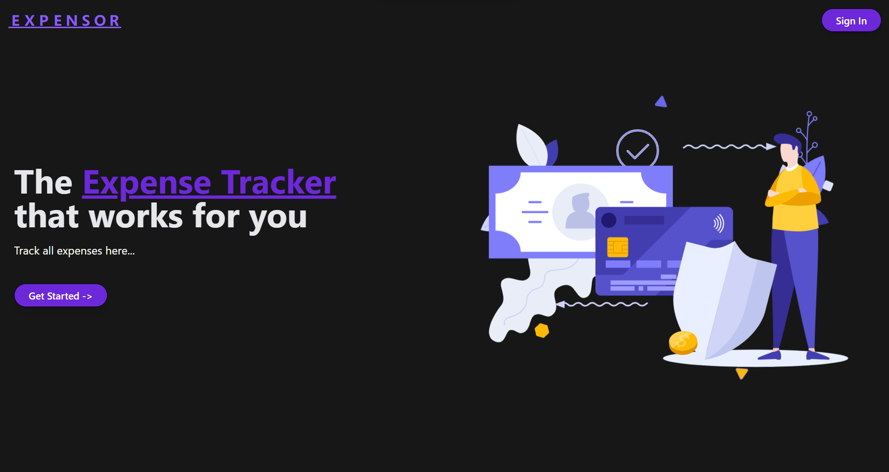
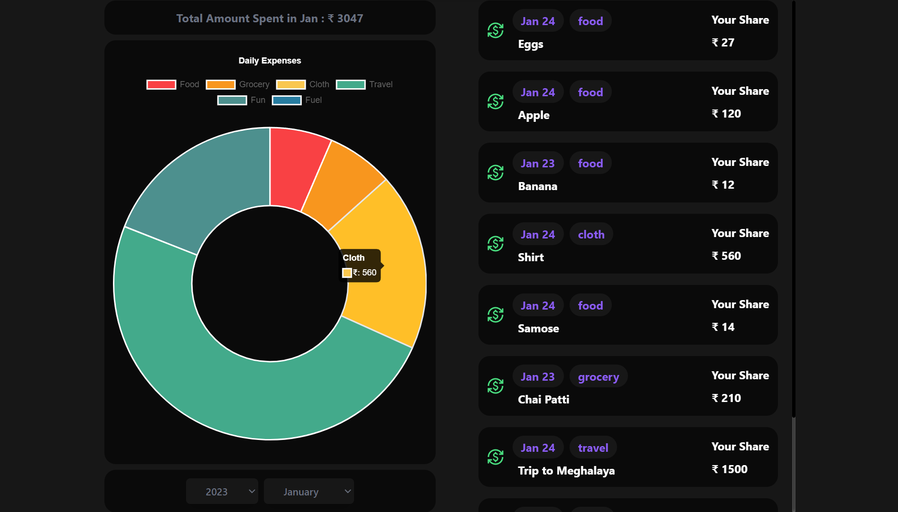
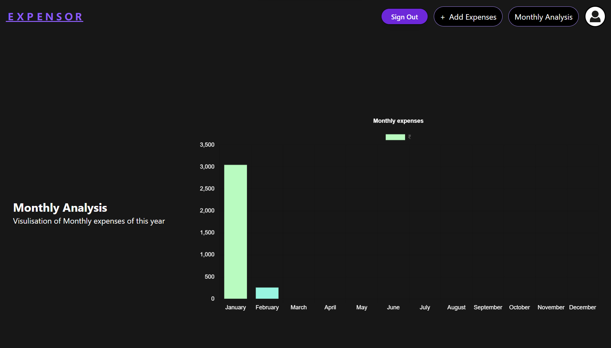
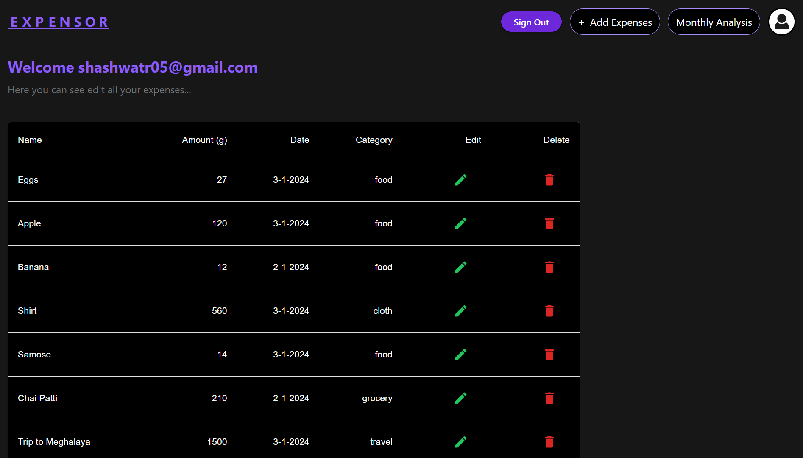

<div align="center">
    
    
    
    
  </div>

  <h3 align="center">Next.js 14 Expense Tracking Application</h3>

    
## Expensor
**E X P E N S O R**


## 📋 <a name="table">Table of Contents</a>

1. 🤖 [Introduction](#introduction)
2. ⚙️ [Tech Stack](#tech-stack)
3. 🔋 [Features](#features)
4. 🤸 [Quick Start](#quick-start)

## <a name="introduction">🤖 Introduction</a>
**Visualise and Track your Daily Expenses**

Expensor is a expense tracking web application where a user can track and visualise his daily expenses.

## <a name="tech-stack">⚙️ Tech Stack</a>

- Next.js
- chart.js
- MongoDB
- NextAuth
- TailwindCSS

## <a name="features">🔋 Features</a>
👉 **Track and Visualise Daily Expenses**: Allow users to keep track of expenses and visualise them on monthly and daily basis.

 
  

👉 **Daily Analysis of Expenses**: User can add his daily expenses and can visualise his expenses in a doughnut chart and also filter the expenses on the basis of months .

  

👉 **Monthly Analysis of Expenses**: User can visualise his expenses of all months for particular year in a Bar Chart.

  
  
👉 **Profile Page**: Each user gets a dedicated profile page where he can see all his expense uptill now.

  

👉 **Responsive Website**: Develop a fully responsive website to ensure optimal user experience across various devices, from desktops to smartphones

## <a name="quick-start">🤸 Quick Start</a>

Follow these steps to set up the project locally on your machine.

**Prerequisites**

Make sure you have the following installed on your machine:

- [Git](https://git-scm.com/)
- [Node.js](https://nodejs.org/en)
- [npm](https://www.npmjs.com/) (Node Package Manager)

**Installation**

Install the project dependencies using npm:

```bash
npm install
```

**Set Up Environment Variables**

Create a new file named `.env` in the root of your project and add the following content:

```env
NEXTAUTH_URL=http://localhost:3000
NEXTAUTH_URL_INTERNAL=http://localhost:3000
NEXTAUTH_SECRET=
GOOGLE_ID=
GOOGLE_CLIENT_SECRET=
MONGODB_URI=
```

Replace the placeholder values with your actual credentials. You can obtain these credentials by signing up on these corresponding websites from [Google Cloud Console](https://console.cloud.google.com/welcome?rapt=AEjHL4MBaLLneW6OfAHf_zgms1eWZFw1wdy0_KIC4uh1nEqh2m4ojOvrXNlzJ4h7CZTkpiWgcsoHbUvS-FMdCP7WIkaVlPAeU7cnVR6Y0wJHeLMOtU6KAzA&project=promptopia-385410), [Cryptpool](https://www.cryptool.org/en/cto/openssl) (for random Auth Secret), and [MongoDB](https://www.mongodb.com/). 

## Contributing
Contributions are welcome! If you encounter any issues or have suggestions for improvements, please feel free to submit a pull request.
